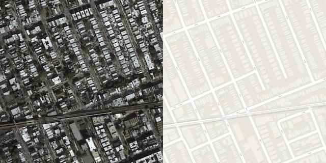
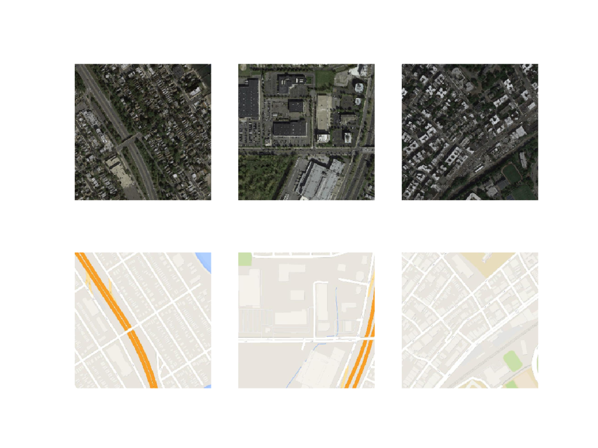
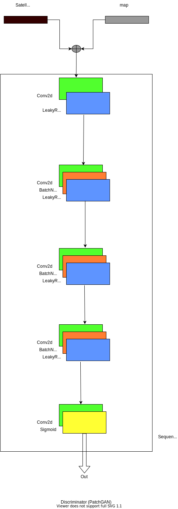

# pix2pix - Pytorch Implementation
This repo is the pytorch implementation of pix2pix architecture as provided in the paper  [Image-to-Image Translation with Conditional Adversarial Networks](https://arxiv.org/abs/1611.07004). Only maps Dataset has been used for training and testing. 

How to use?
* Clone the repo
* [Download](http://efrosgans.eecs.berkeley.edu/pix2pix/datasets/maps.tar.gz) the Maps dataset and unzip it into cloned repo (working directory). This will create a directory called “maps”, with "train" and "val" folderinside it. 
* To train, run train.py

## Maps Dataset

Each image in the dataset is in JPEG format with 1200px * 600px dimensions, containing satellite image with its correspondng map. A sample image has been shown below. 

  

Sample after splitting the raw image into seperate  "Satellite" and corresponding "map" images. 

  

## Architectural Details
--------------------------
Pix2pix architecture uses Unet architecture as a Generator and PatchGAN as a Discriminator. 

patchGAN architecture used as Discriminator as shown below.

  

